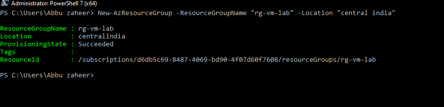
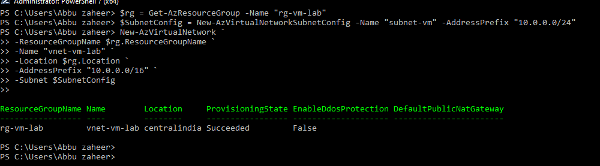
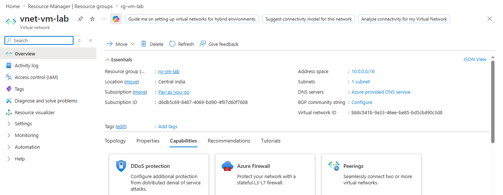
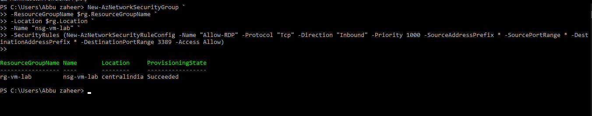
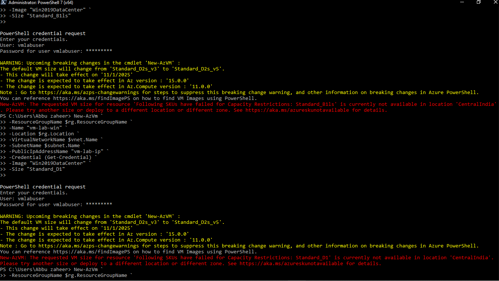
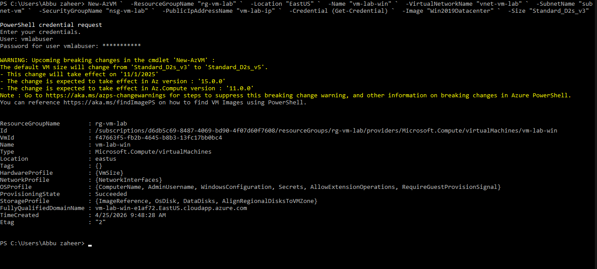

**Lab 3: Azure Virtual Machine Deployment with PowerShell**

🎯 Objective  
Provision a virtual machine in Azure using PowerShell, including setup of networking, security, and verification of deployment.

**⚙️ Resources Deployed**

Resource Group: rg-vm-lab
Virtual Network: vnet-vm-lab
Subnet: subnet-vm
Network Security Group: nsg-vm-lab (with RDP rule)
Public IP Address: vm-lab-ip
Virtual Machine: vm-lab-win (Windows Server 2019 Datacenter)

**📸 Screenshots**

### 1. Resource Group Creation
The resource group **rg-vm-lab** was successfully created in the Central India region.

### 2. Virtual Network and Subnet Creation
A new virtual network vnet-vm-lab was provisioned with address space 10.0.0.0/16 and subnet subnet-vm.
  

Azure portal view showing the **vnet-vm-lab** configuration and capabilities.
  

### 3. Network Security Group
A Network Security Group **nsg-vm-lab** was created with an inbound rule allowing RDP (port 3389).
  

### 4. VM Deployment Attempts
Initial VM deployment attempts failed due to unavailable sizes in the *Central India* region.
  

### 5. VM Deployment Success
The VM **vm-lab-win** was successfully deployed in *East US* with the image **Win2019Datacenter**.
  

**📚 Key Learnings**

How to provision a VM in Azure using PowerShell.
How to configure networking (VNet, Subnet, NSG) for secure access.
How to handle VM size availability issues across regions.
How to verify VM deployment and retrieve connection details.

**📌 Resume Bullets**

Provisioned and configured Azure Virtual Machine using PowerShell.
Implemented secure networking with VNet, Subnet, and NSG rules.
Resolved VM size capacity restrictions by selecting alternate region and size.
Verified successful VM deployment and connectivity.
