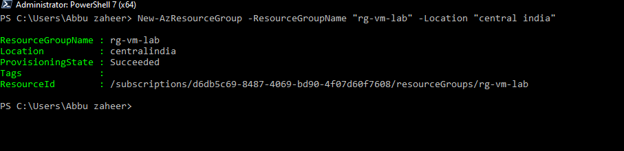
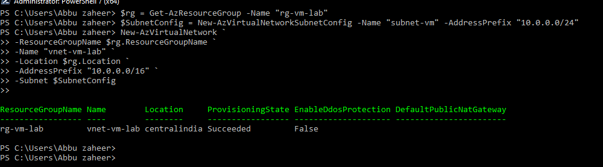
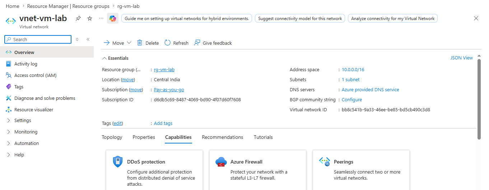
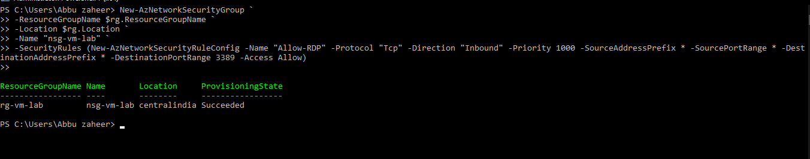
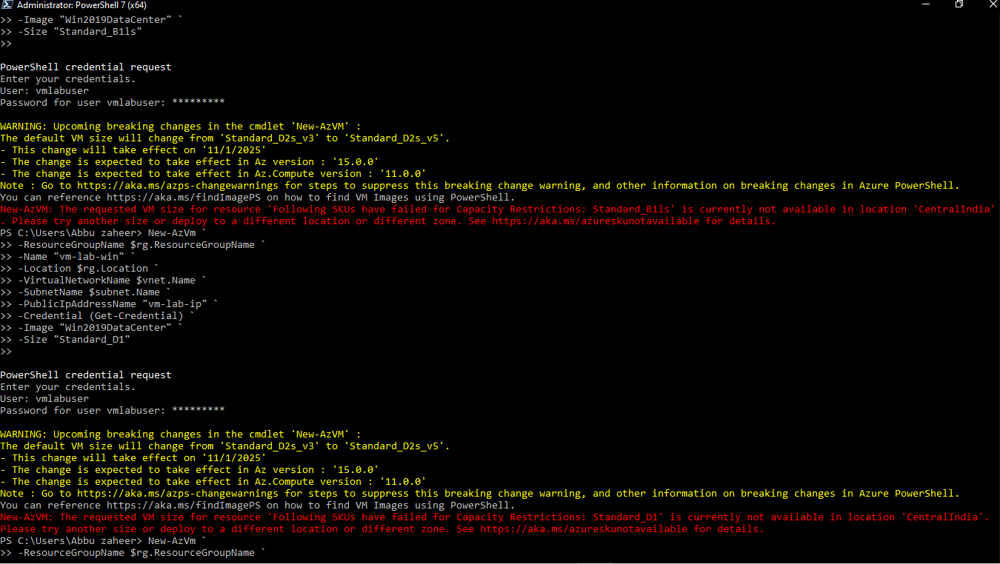
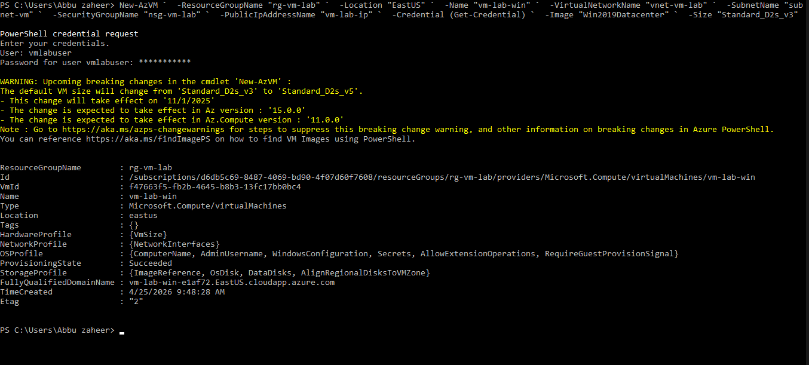

# **Lab 3: Azure Virtual Machine Deployment with PowerShell**

## 🎯 Objective  
Provision and configure an Azure Virtual Machine using PowerShell, including virtual networking, NSG configuration, VM deployment validation, and troubleshooting VM size availability issues.

## **⚙️ Resources Deployed**
| Resource Type | Name | Purpose |
|---|---|---|
| Resource Group | rg-vm-lab | Logical container for VM resources |
| Virtual Network | vnet-vm-lab | Provides network isolation and connectivity |
| Subnet | subnet-vm | Hosts VM network resources |
| Network Security Group | nsg-vm-lab | Controls inbound RDP access |
| Public IP Address | vm-lab-ip | Enables remote connectivity |
| Virtual Machine | vm-lab-win | Windows Server 2019 virtual machine |

## **📸 Screenshots**

### 1. Resource Group Deployment
Provisioned the Resource Group using Azure PowerShell for centralized infrastructure management

### 2. Virtual Network and Subnet Deployment
A new virtual network vnet-vm-lab was provisioned with address space 10.0.0.0/16 and subnet subnet-vm.
  

Azure portal view showing the **vnet-vm-lab** configuration and capabilities.
  

### 3. Network Security Group Configuration
Configured NSG rules to allow secure inbound RDP access for VM administration.
  

### 4. VM Deployment Troubleshooting
Initial VM deployment attempts failed because selected VM sizes were unavailable in the Central India region. The deployment was retried using an alternate region and supported VM size.
  

### 5. VM Provisioning Validation
Verified successful Windows Server VM deployment through Azrue Portal resource validation.
  

## Troubleshooting
### VM Size Capacity Restriction
Initial VM deployment attempts in the Central India region failed due to SKU availability and capacity restrictions for selected VM sizes. 

### Resolution
Resolved the deployment issue by selecting an alternate Azure region and supported VM size, allowing successful VM provisioning and validation.

## Operational Validation
 
- Verified successful VM deployment through Azure Portal and PowerShell outputs.
- Confirmed NSG rule application for inbound RDP traffic.
- Validated successful association between VM, subnet, NSG, and Public IP resources.
- Reviewed VM provisioning status and infrastructure resource health after deployment.

## **📚 Key Learnings**

- Provisioned Azure Virtual Machines using Azure PowerShell.
- Configured VNet, Subnet, Public IP, and NSG resources.
- Implemented inbound RDP access using NSG rules.
- Identified VM SKU availability issues during deployment.
- Resolved deployment failures by selecting alternate VM size and region.
- Verified successful VM provisioning and connectivity.

## **📌 Resume Alignment**

Provisioned and configured Azure Virtual Machine using PowerShell.
Implemented secure networking with VNet, Subnet, and NSG rules.
Resolved VM size capacity restrictions by selecting alternate region and size.
Verified successful VM deployment and connectivity.
